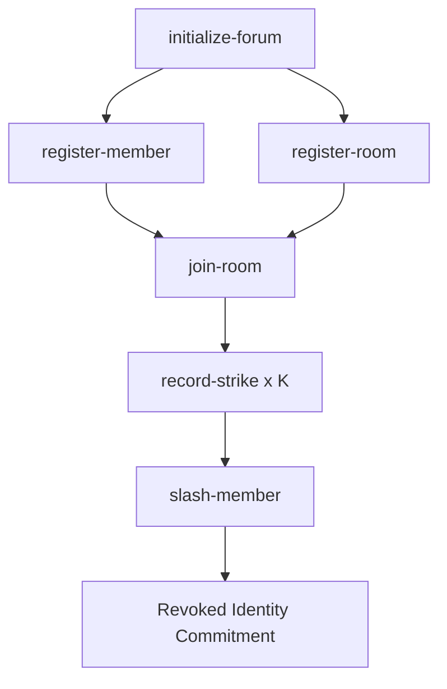

# E-Identity-Stack

Privacy-preserving anonymous identity registry, room management, and strike-based moderation infrastructure built for the **Logos Execution Zone (LEZ)** testnet using **SPEL (Smart Program Execution Layer)** and **RISC0 ZKVM**.

---

## Protocol Overview

The **E-Identity Stack** enables sybil-resistant anonymous participation in decentralized forums and chat applications. It decouples a user's real public key/wallet from their forum actions using zero-knowledge identity commitments, while enforcing accountability through a decentralized moderator strike & slashing framework.

### Key Pillars
- **Zero-Knowledge Identity Commitments**: Members register using cryptographic commitments without disclosing their real identity on-chain.
- **Multi-Moderator Threshold Security**: Rooms require $N$-of-$M$ threshold signatures from designated moderators to issue valid strike certificates against misbehaving members.
- **Deterministic Room Derivation**: Rooms are cryptographically derived on-chain using SHA-256 hashes of creation indices and threshold parameters.
- **On-Chain Slashing & Revocation**: Accumulating $K$ strikes across active room memberships revokes a member's identity commitment on-chain, nullifying their forum privileges.

---

## Repository Architecture

The workspace is structured into modular components separating on-chain guest execution, core business logic, and off-chain SDKs:

```
e-identity-stack/
├── program_methods/guest/          # SPEL Guest Programs (RISC0 ZKVM target)
│   └── src/bin/
│       ├── membership_registry.rs  # Main SPEL contract guest entrypoint
│       └── forum_membership_proof.rs # Membership ZK proof circuit guest
│
├── programs/membership_registry/   # On-Chain Business Logic Crate
│   └── src/
│       ├── state.rs                # ForumInstance, Room, Member, OnChainMembership models
│       ├── initialize.rs           # Forum initialization handler
│       ├── register.rs             # Member registration handler
│       ├── register_room.rs        # Deterministic room registration handler
│       ├── join_room.rs            # Room membership joining handler
│       ├── record_strike.rs        # Strike verification & recording handler
│       └── slash.rs                # Identity revocation & slashing handler
│
├── e_identity_sdk/                 # Off-Chain Identity & Room Management SDK
├── e_moderation_sdk/               # Off-Chain Threshold Moderation & Strike Certificate SDK
├── docs/
│   └── build_deploy_test_output.md # Full E2E execution log & transaction verification
├── Cargo.toml                      # Workspace manifest (LEZ v0.2.4 & SPEL main)
└── idl.json                        # Generated SPEL IDL Interface
```

---

## On-Chain State Model

The core state is encapsulated within the `ForumInstance` PDA (Program Derived Account):

```rust
pub struct ForumInstance {
    pub admin: [u8; 32],
    pub k_strikes: u32,
    pub n_moderators: u32,
    pub m_moderators: u32,
    pub current_index: u64,
    pub registered_commitments: Vec<[u8; 32]>,
    pub revoked_commitments: Vec<[u8; 32]>,
    pub rooms: Vec<Room>,
    pub room_memberships: Vec<OnChainMembership>,
    pub strikes: Vec<Strike>,
}
```

---

## End-to-End Instruction Lifecycle



1. **`initialize-forum`**: Sets up the forum instance, admin authority, strike threshold ($K$), and moderator requirements.
2. **`register-member`**: Registers a member's anonymous identity commitment on-chain.
3. **`register-room`**: Creates a moderated sub-room with specified threshold configuration ($N$-of-$M$) and derives a unique `room_id`.
4. **`join-room`**: Creates an active `OnChainMembership` record binding a registered member commitment to a specific room.
5. **`record-strike`**: Records a strike against a room member upon providing valid moderator threshold signatures ($N \ge N_{\text{threshold}}$).
6. **`slash-member`**: Revokes the target's identity commitment once total strikes reach or exceed $K$.

---

## Prerequisites & Setup

### Requirements
- **Rust Toolchain**: `nightly` / `stable` (edition 2021)
- **RISC0 Toolchain**: `cargo-risczero` with target `riscv32im-risc0-zkvm-elf`
- **Docker**: Required by `cargo risczero build` for deterministic containerized builds
- **LEZ Wallet CLI**: `wallet` (built from `logos-execution-zone` tag `v0.2.4`)
- **SPEL CLI**: `spel` (built from `logos-co/spel` branch `main`)

---

## Quickstart Guide

### 1. Build Guest Binaries
Compile the ZKVM guest binaries using RISC0 Docker builder:
```bash
cargo risczero build --manifest-path program_methods/guest/Cargo.toml
```
*Output binaries will be located at `target/riscv32im-risc0-zkvm-elf/docker/membership_registry.bin`.*

### 2. Generate IDL Interface
Generate the JSON IDL definition for client and CLI interactions:
```bash
spel generate-idl program_methods/guest/src/bin/membership_registry.rs > idl.json
```

### 3. Deploy Program to LEZ Testnet
Deploy the compiled binary to the testnet using the LEZ wallet:
```bash
wallet deploy-program target/riscv32im-risc0-zkvm-elf/docker/membership_registry.bin
```

---

## CLI Execution (E2E Test Steps)

> ⚠️ **IMPORTANT CLI RULE**: When executing `spel` commands, **ALWAYS pass the binary file path** via `-p target/riscv32im-risc0-zkvm-elf/docker/membership_registry.bin`. Do NOT pass the raw hex Program ID, as endianness byte-swapping between `ProgramId` and `ImageID` will cause sequencer transaction rejection.

### Step 1: Initialize Forum
```bash
spel --idl idl.json -p target/riscv32im-risc0-zkvm-elf/docker/membership_registry.bin -- \
  initialize-forum \
  --admin Public/9p7BZn9g6UrVMBiatyeNtq4yv9DitxYM1ZXsjYi6vf47 \
  --forum-id 0102030405060708091011121314151617181920212223242526272829303132 \
  --k-strikes 3 --n-moderators 2 --m-moderators 3
```

### Step 2: Register Member
```bash
spel --idl idl.json -p target/riscv32im-risc0-zkvm-elf/docker/membership_registry.bin -- \
  register-member \
  --member Public/9p7BZn9g6UrVMBiatyeNtq4yv9DitxYM1ZXsjYi6vf47 \
  --forum-id 0102030405060708091011121314151617181920212223242526272829303132 \
  --commitment 0a0b0c0d0e0f1011121314151617181920212223242526272829303132333435 \
  --stake-amount 0
```

### Step 3: Register Room
```bash
spel --idl idl.json -p target/riscv32im-risc0-zkvm-elf/docker/membership_registry.bin -- \
  register-room \
  --admin Public/9p7BZn9g6UrVMBiatyeNtq4yv9DitxYM1ZXsjYi6vf47 \
  --forum-id 0102030405060708091011121314151617181920212223242526272829303132 \
  --admin-commitment 0a0b0c0d0e0f1011121314151617181920212223242526272829303132333435 \
  --n-mod-threshold 1 --m-mod-total 1 \
  --moderator-pubkeys AA01020304050607080910111213141516171819202122232425262728293031 \
  --min-members-for-maturity 1
```

### Step 4: Join Room
```bash
spel --idl idl.json -p target/riscv32im-risc0-zkvm-elf/docker/membership_registry.bin -- \
  join-room \
  --member Public/9p7BZn9g6UrVMBiatyeNtq4yv9DitxYM1ZXsjYi6vf47 \
  --forum-id 0102030405060708091011121314151617181920212223242526272829303132 \
  --room-id 4387847341ba4199b858e82e6d2114e8ef00611ae38bfce0ead60983e2fda6ca \
  --member-commitment 0a0b0c0d0e0f1011121314151617181920212223242526272829303132333435
```

### Step 5: Record Strikes (Collect $K=3$ Strikes)
```bash
# Strike #1
spel --idl idl.json -p target/riscv32im-risc0-zkvm-elf/docker/membership_registry.bin -- \
  record-strike \
  --forum-id 0102030405060708091011121314151617181920212223242526272829303132 \
  --room-id 4387847341ba4199b858e82e6d2114e8ef00611ae38bfce0ead60983e2fda6ca \
  --target-commitment 0a0b0c0d0e0f1011121314151617181920212223242526272829303132333435 \
  --evidence-hash BB0b0c0d0e0f1011121314151617181920212223242526272829303132333435 \
  --n-valid-sigs 1

# Strike #2
spel --idl idl.json -p target/riscv32im-risc0-zkvm-elf/docker/membership_registry.bin -- \
  record-strike \
  --forum-id 0102030405060708091011121314151617181920212223242526272829303132 \
  --room-id 4387847341ba4199b858e82e6d2114e8ef00611ae38bfce0ead60983e2fda6ca \
  --target-commitment 0a0b0c0d0e0f1011121314151617181920212223242526272829303132333435 \
  --evidence-hash CC0b0c0d0e0f1011121314151617181920212223242526272829303132333435 \
  --n-valid-sigs 1

# Strike #3
spel --idl idl.json -p target/riscv32im-risc0-zkvm-elf/docker/membership_registry.bin -- \
  record-strike \
  --forum-id 0102030405060708091011121314151617181920212223242526272829303132 \
  --room-id 4387847341ba4199b858e82e6d2114e8ef00611ae38bfce0ead60983e2fda6ca \
  --target-commitment 0a0b0c0d0e0f1011121314151617181920212223242526272829303132333435 \
  --evidence-hash DD0b0c0d0e0f1011121314151617181920212223242526272829303132333435 \
  --n-valid-sigs 1
```

### Step 6: Slash Member
```bash
spel --idl idl.json -p target/riscv32im-risc0-zkvm-elf/docker/membership_registry.bin -- \
  slash-member \
  --authority Public/9p7BZn9g6UrVMBiatyeNtq4yv9DitxYM1ZXsjYi6vf47 \
  --forum-id 0102030405060708091011121314151617181920212223242526272829303132 \
  --target-commitment 0a0b0c0d0e0f1011121314151617181920212223242526272829303132333435 \
  --k-rooms-min 1 --min-room-age-indexes 0 --min-room-members 0
```

---

## Verified Testnet Execution Results

All 8 instructions were successfully confirmed on the live **Logos Execution Zone Testnet**:

| Step | Instruction | State / Target Account | Transaction Hash | Status |
|---|---|---|---|---|
| 1 | **Deploy Program** | Bytecode (545.5 KB) | `0xe318804f7782f4c950e39b19367542ef4f437527...` | ✅ Block 27149 |
| 2 | `initialize-forum` | PDA `CE22m9A5oBG...` | `0x6f59c5f3af7f19ff12c00f2590c3a426901d90db...` | ✅ Confirmed |
| 3 | `register-member` | Member Commitment | `0x494ccc903eaae27bb4ceaf572e9a2636f32e6ee5...` | ✅ Confirmed |
| 4 | `register-room` | Room ID Derived | `0x7ee5c78c813aa72906fc60eaa716d97b47ab1faa...` | ✅ Confirmed |
| 5 | `join-room` | Active Membership | `0xf5e44d15d6caef2fa1dd13e4fb2d77ee4f141db3...` | ✅ Confirmed |
| 6 | `record-strike` #1 | Evidence `BB0b...` | `0xdbe15142a5bc1be8fcdd9574d6c41b80261ca209...` | ✅ Confirmed |
| 7 | `record-strike` #2 | Evidence `CC0b...` | `0xc495b562a046c0d8dfeb9eebdf1059f33c7f9999...` | ✅ Confirmed |
| 8 | `record-strike` #3 | Evidence `DD0b...` | `0x0479fb04fb17585b736ca8c8a14b51ea46bc37e6...` | ✅ Confirmed |
| 9 | `slash-member` | **Identity Revoked** | `0x110c219808edeece7a08b53cf5fcfb9aa6f4cba5...` | ✅ Confirmed |

*Full step-by-step transaction output and verification logs are available in [`docs/build_deploy_test_output.md`](docs/build_deploy_test_output.md).*

---

## Technical Gotchas & Protocol Caveats

1. **SPEL Macro Account Naming (`ExecuteTransformer`)**:
   Identifiers in `SpelOutput::execute(vec![state.account, member.account], vec![])` MUST match function argument names (`state`, `member`). Using temporary clone names like `state_mut` disables SPEL's auto-claim macro rewriting, leading to Rule 7 account ownership rejections.
2. **LEZ Rule 5 Balance Decreases (`TODO(stake)`)**:
   Under LEZ Rule 5, non-owning programs cannot decrease an account's balance. Accounts funded via `wallet pinata claim` are pre-owned by `auth-transfer`. Direct stake deductions on user accounts are currently bypassed (`TODO(stake)`) pending official SPEL Cross-Program Invocation (CPI) guidelines.
3. **Signer Auto-Claim (SPEL PR [#262](https://github.com/logos-co/spel/pull/262))**:
   Signers are auto-claimed upon their initial transaction using `AutoClaim::ClaimedIfDefault(Claim::Authorized)` to satisfy LEZ Rule 7.

---

## License

Dual-licensed under MIT and Apache 2.0
