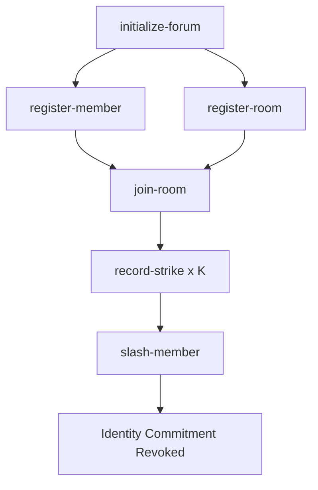

# E-Identity-Stack

Privacy-preserving anonymous identity registry, room management, and strike-based moderation infrastructure built for the **Logos Execution Zone (LEZ)** testnet using **SPEL (Smart Program Execution Layer)** and **RISC0 ZKVM**.

## Protocol Overview

The **E-Identity Stack** enables sybil-resistant anonymous participation in decentralized forums and chat applications. It decouples a user's real wallet identity from their forum actions using zero-knowledge identity commitments, while enforcing accountability through a decentralized moderator strike & slashing framework.

### Key Pillars

- **Nullifier Secret Key (NSK) Commitments**: Members register using `Commitment = SHA256(NSK)` without disclosing their real identity on-chain. The NSK is never stored — only its hash.
- **Two-Tier Shamir Secret Sharing (SSS)**: The NSK is split across posts using a two-tier polynomial scheme. Each post reveals a point on a Tier-2 polynomial; accumulating K strikes across K posts allows full NSK reconstruction via Lagrange interpolation over GF(2⁸).
- **Multi-Moderator Threshold Security**: Each strike requires N-of-M moderator BIP-340 Schnorr signatures. Per-post secret shares are ECDH-encrypted to individual moderator public keys.
- **Anti-Sybil Room Diversity**: Slashing requires strikes from K_rooms_min distinct rooms, each meeting maturity requirements (minimum age + member count), preventing puppet-room attacks.
- **Zero-Knowledge Membership Proofs**: A RISC0 ZKVM guest program proves Merkle-tree membership and non-revocation without revealing the underlying NSK.

## Repository Architecture

```
e-identity-stack/
├── program_methods/guest/              # SPEL Guest Programs (RISC0 ZKVM target)
│   └── src/bin/
│       ├── membership_registry.rs      # On-chain registry: 7 instructions
│       └── forum_membership_proof.rs   # ZK proof: Merkle membership + non-revocation
│
├── programs/membership_registry/       # On-Chain Business Logic
│   └── src/
│       ├── state.rs                    # ForumInstance, OnChainRoom, OnChainMembership, OnChainStrike
│       ├── initialize.rs              # Forum initialization
│       ├── register.rs                # Member commitment registration
│       ├── register_room.rs           # Deterministic room creation (SHA-256 derived room_id)
│       ├── join_room.rs               # Room membership binding
│       ├── record_strike.rs           # Strike recording with membership + threshold validation
│       ├── slash.rs                   # Identity revocation upon K strikes
│       └── verify_post.rs            # Post verification
│
├── e_identity_sdk/                     # Off-Chain Identity SDK
│   └── src/
│       ├── identity/
│       │   ├── registration.rs        # RegistrationClient: NSK generation, SSS + ECDH share encryption
│       │   ├── username.rs            # UsernameRegistry: commitment ↔ username mapping + Schnorr proofs
│       │   └── blacklist.rs           # Commitment blacklist management
│       ├── moderation/
│       │   ├── strike.rs              # StrikeCertificate validation, BIP-340 signing/verification
│       │   ├── release_share.rs       # ReleaseShareValidator: 7-step anti-Sybil validation pipeline
│       │   └── anti_sybil.rs          # AntiSybilConfig, room diversity checks
│       ├── room/
│       │   ├── management.rs          # RoomRegistry: create/join/leave rooms with signed consent
│       │   ├── moderator_registry.rs  # ModeratorRegistry: per-room moderator tracking
│       │   └── maturity.rs            # Room maturity checks (age + member count)
│       └── types.rs                   # UserRecord, RoomConfig, MembershipRecord, StrikeCertificate
│
├── e_moderation_sdk/                   # Off-Chain Moderation & Cryptographic Primitives
│   └── src/
│       ├── crypto/
│       │   ├── sss.rs                 # Shamir Secret Sharing: split_secret / recover_secret (GF(2⁸))
│       │   ├── ecdh.rs                # ECDH key exchange (secp256k1) + XOR stream cipher
│       │   └── signature/             # BIP-340 Schnorr signatures (PrivateKey, PublicKey, Signature)
│       ├── clients/
│       │   ├── member.rs              # MemberClient: prepare_post with two-tier SSS + ECDH encryption
│       │   ├── moderator.rs           # ModeratorClient: issue_strike with share decryption + signing
│       │   └── aggregator.rs          # SlashAggregator: reconstruct_strike (Tier-1) + reconstruct_nsk (Tier-2)
│       ├── ffi.rs                     # C FFI bindings for all three client roles
│       └── types.rs                   # PostPayload, EncryptedSharePerPost, ModerationCertificate
│
├── docs/
│   └── build_deploy_test_output.md    # Full E2E testnet execution log
├── Cargo.toml                         # Workspace manifest (LEZ v0.2.4, SPEL main)
└── idl.json                           # Generated SPEL IDL interface
```

## Core Cryptographic Architecture

### Two-Tier Shamir Secret Sharing

The protocol uses a novel two-tier SSS construction to enable progressive identity de-anonymization:

```
                    NSK (Nullifier Secret Key)
                            │
                    ┌───────┴───────┐
                    │  Tier-2 SSS   │  K-of-255 polynomial over GF(2⁸)
                    │  (at signup)  │  K = k_strikes threshold
                    └───────┬───────┘
                            │
              ┌─────────────┼─────────────┐
              │             │             │
         S_post(1)     S_post(2)     S_post(K)    ← one point per flagged post
              │             │             │
        ┌─────┴─────┐ ┌────┴────┐  ┌─────┴─────┐
        │ Tier-1 SSS│ │Tier-1   │  │ Tier-1    │  N-of-M per post
        │ (per post)│ │(per post│  │ (per post)│  N = n_mod_threshold
        └─────┬─────┘ └────┬───┘  └─────┬─────┘
              │             │             │
        ┌─────┼─────┐      ...     ┌─────┼─────┐
        │     │     │              │     │     │
      Mod₁  Mod₂  ModM          Mod₁  Mod₂  ModM   ← ECDH-encrypted shares
```

**Flow**:
1. **Registration**: Member generates NSK, computes `Commitment = SHA256(NSK)`, splits NSK into a Tier-2 polynomial with threshold K.
2. **Posting**: Each post evaluates the Tier-2 polynomial at `x = post_counter` to produce `S_post`. This `S_post` is then split via Tier-1 SSS (N-of-M threshold) and each share is ECDH-encrypted to individual moderator public keys.
3. **Strike**: When N moderators agree to strike a post, they each decrypt their Tier-1 share and sign it (BIP-340 Schnorr). The `SlashAggregator` reconstructs `S_post` via Lagrange interpolation.
4. **Slashing**: After K strikes across K distinct posts, the aggregator has K points `(x_i, S_post_i)` on the Tier-2 polynomial. A final Lagrange interpolation reconstructs the original NSK, revoking the member's anonymity.

### Cryptographic Primitives

| Primitive | Implementation | Usage |
|---|---|---|
| **Shamir Secret Sharing** | `sharks` crate (GF(2⁸)) | NSK splitting (Tier-2) and per-post share splitting (Tier-1) |
| **ECDH Key Exchange** | `k256` (secp256k1) | Encrypting SSS shares to moderator public keys |
| **BIP-340 Schnorr Signatures** | Custom `signature` module | Moderator strike signing, username change proofs, join consent |
| **SHA-256 Hashing** | `sha2` crate | Commitments, room ID derivation, tracing tags, domain-separated message construction |
| **XOR Stream Cipher** | Custom `ecdh::xor_encrypt` | Symmetric encryption of shares using ECDH-derived keystream |

### Domain-Separated Hash Constructions

| Domain Tag | Used For |
|---|---|
| `EVICE/v1/ECDH/` | ECDH shared secret derivation |
| `EVICE/v1/Strike/` | Strike certificate message construction |
| `EVICE/v1/ModerationStrike/` | Aggregator signature verification |

## On-Chain State Model

The core state is stored in the `ForumInstance` PDA (Program Derived Account), serialized via Borsh:

```rust
pub struct ForumInstance {
    pub admin_pubkey: [u8; 32],          // Forum administrator
    pub k_strikes: u32,                   // Strikes needed for slashing
    pub n_moderators: u32,                // Forum-level moderator threshold
    pub m_moderators: u32,                // Forum-level total moderators
    pub registered_commitments: Vec<[u8; 32]>,  // Active member commitments
    pub revoked_commitments: Vec<[u8; 32]>,     // Slashed/revoked commitments
    pub total_staked: u64,                // Total staked tokens (TODO: bypassed)
    pub member_stakes: Vec<([u8; 32], u64)>,    // Per-member stake records
    pub used_tracing_tags: Vec<[u8; 32]>,       // Anti-replay tracing tags
    pub rooms: Vec<OnChainRoom>,          // Registered rooms
    pub room_memberships: Vec<OnChainMembership>, // Active room memberships
    pub recorded_strikes: Vec<OnChainStrike>,     // Recorded strikes
    pub current_index: u64,               // Monotonic ordering counter
}
```

## Zero-Knowledge Membership Proof Circuit

The `forum_membership_proof` RISC0 guest program enables anonymous posting by proving:

1. **Merkle Membership**: The prover's commitment exists in the registry Merkle tree (verified via `compute_digest_for_path`).
2. **Non-Revocation**: The commitment is not in the revoked commitments list.
3. **Tracing Tag Computation**: Outputs `tracing_tag = SHA256(NSK || message_hash || post_salt)` — linkable across posts by the same identity but unlinkable to the real wallet.

```
Private Inputs:  NSK, Merkle proof path
Public Inputs:   Registry root, revoked list, message_hash, post_salt
Output (committed): registry_root, message_hash, tracing_tag
```

---

## End-to-End Instruction Lifecycle



1. **`initialize-forum`**: Creates PDA state with admin, strike threshold K, and moderator configuration.
2. **`register-member`**: Registers a member's `SHA256(NSK)` commitment on-chain.
3. **`register-room`**: Creates a moderated sub-room with N-of-M threshold. Room ID is deterministically derived: `SHA256(admin_commitment || creation_index || n_mod || m_mod)`.
4. **`join-room`**: Binds a registered member commitment to a specific room via an `OnChainMembership` record.
5. **`record-strike`**: Records a strike against a room member. Validates active membership and moderator signature threshold.
6. **`slash-member`**: Revokes the target's identity commitment once total strikes reach K.

## Off-Chain Client Roles

### `MemberClient` (`e_moderation_sdk`)
Prepares anonymous posts with embedded two-tier SSS shares:
- Evaluates Tier-2 polynomial at `x = post_counter` → `S_post`
- Splits `S_post` via Tier-1 SSS (N-of-M)
- ECDH-encrypts each share to its corresponding moderator public key
- Generates deterministic `tracing_tag = SHA256(NSK || message_hash || salt)`

### `ModeratorClient` (`e_moderation_sdk`)
Processes moderation decisions:
- Decrypts their Tier-1 share via ECDH
- Signs `SHA256("EVICE/v1/ModerationStrike/" || tracing_tag || share)` with BIP-340 Schnorr
- Issues a `ModerationCertificate` containing the decrypted share + signature

### `SlashAggregator` (`e_moderation_sdk`)
Coordinates the slashing pipeline:
- **`reconstruct_strike`**: Collects N moderator certificates for a single post → reconstructs `S_post` via Lagrange interpolation
- **`reconstruct_nsk`**: Collects K `(x_index, S_post)` points across K posts → reconstructs the original NSK

### `RegistrationClient` (`e_identity_sdk`)
Manages identity lifecycle:
- Generates random NSK and derives `Commitment = SHA256(NSK)`
- Prepares registration payload with Tier-2 SSS shares encrypted to node public keys
- Signs username change proofs via BIP-340 Schnorr

### `ReleaseShareValidator` (`e_identity_sdk`)
Full 7-step anti-Sybil validation for slashing transactions:
1. K strike certificates present
2. All certificates target the same commitment
3. ≥ K_rooms_min distinct room IDs
4. Each room meets maturity (age + member count)
5. Target has signed membership in each room
6. Anti-replay check via strike_index
7. N_mod signatures verified per certificate

## FFI / C Bindings

The `e_moderation_sdk` exposes a complete C FFI layer (`ffi.rs`) for cross-language integration:

| Function | Description |
|---|---|
| `ffi_member_new` / `ffi_member_free` | Create/destroy MemberClient |
| `ffi_member_prepare_post` | Prepare anonymous post with encrypted shares (returns JSON) |
| `ffi_moderator_new` / `ffi_moderator_free` | Create/destroy ModeratorClient |
| `ffi_moderator_public_key` | Export moderator's 32-byte public key |
| `ffi_moderator_issue_strike` | Issue strike certificate (returns JSON) |
| `ffi_aggregator_new` / `ffi_aggregator_free` | Create/destroy SlashAggregator |
| `ffi_aggregator_reconstruct_strike` | Reconstruct S_post from N certificates |
| `ffi_aggregator_reconstruct_nsk` | Reconstruct NSK from K accumulated strikes |
| `ffi_free_string` | Free JSON string returned by any FFI function |

## Prerequisites & Setup

### Requirements
- **Rust Toolchain**: `nightly` / `stable` (edition 2021)
- **RISC0 Toolchain**: `cargo-risczero` with target `riscv32im-risc0-zkvm-elf`
- **Docker**: Required by `cargo risczero build` for deterministic containerized builds
- **LEZ Wallet CLI**: `wallet` (built from `logos-execution-zone` tag `v0.2.4`)
- **SPEL CLI**: `spel` (built from `logos-co/spel` branch `main`)

## Quickstart Guide

### 1. Build Guest Binaries
```bash
cargo risczero build --manifest-path program_methods/guest/Cargo.toml
```

### 2. Generate IDL Interface
```bash
spel generate-idl program_methods/guest/src/bin/membership_registry.rs > idl.json
```

### 3. Deploy Program to LEZ Testnet
```bash
wallet deploy-program target/riscv32im-risc0-zkvm-elf/docker/membership_registry.bin
```

### 4. Run Off-Chain Tests
```bash
cargo test --workspace
```

## CLI Execution (E2E Test Steps)

> **IMPORTANT**: Always pass the **binary file path** via `-p target/riscv32im-risc0-zkvm-elf/docker/membership_registry.bin`. Do NOT pass the raw hex Program ID — endianness byte-swapping between `ProgramId` and `ImageID` causes sequencer rejection.

### Step 1: Initialize Forum
```bash
spel --idl idl.json -p target/riscv32im-risc0-zkvm-elf/docker/membership_registry.bin -- \
  initialize-forum \
  --admin Public/<ACCOUNT_ID> \
  --forum-id <32-BYTE-HEX> \
  --k-strikes 3 --n-moderators 2 --m-moderators 3
```

### Step 2: Register Member
```bash
spel --idl idl.json -p target/riscv32im-risc0-zkvm-elf/docker/membership_registry.bin -- \
  register-member \
  --member Public/<ACCOUNT_ID> \
  --forum-id <32-BYTE-HEX> \
  --commitment <32-BYTE-HEX> \
  --stake-amount 0
```

### Step 3: Register Room
```bash
spel --idl idl.json -p target/riscv32im-risc0-zkvm-elf/docker/membership_registry.bin -- \
  register-room \
  --admin Public/<ACCOUNT_ID> \
  --forum-id <32-BYTE-HEX> \
  --admin-commitment <32-BYTE-HEX> \
  --n-mod-threshold 1 --m-mod-total 1 \
  --moderator-pubkeys <32-BYTE-HEX> \
  --min-members-for-maturity 1
```

### Step 4: Join Room
```bash
spel --idl idl.json -p target/riscv32im-risc0-zkvm-elf/docker/membership_registry.bin -- \
  join-room \
  --member Public/<ACCOUNT_ID> \
  --forum-id <32-BYTE-HEX> \
  --room-id <DERIVED-ROOM-ID-HEX> \
  --member-commitment <32-BYTE-HEX>
```

### Step 5: Record Strikes (repeat K times with unique evidence)
```bash
spel --idl idl.json -p target/riscv32im-risc0-zkvm-elf/docker/membership_registry.bin -- \
  record-strike \
  --forum-id <32-BYTE-HEX> \
  --room-id <DERIVED-ROOM-ID-HEX> \
  --target-commitment <32-BYTE-HEX> \
  --evidence-hash <32-BYTE-HEX> \
  --n-valid-sigs 1
```

### Step 6: Slash Member
```bash
spel --idl idl.json -p target/riscv32im-risc0-zkvm-elf/docker/membership_registry.bin -- \
  slash-member \
  --authority Public/<ACCOUNT_ID> \
  --forum-id <32-BYTE-HEX> \
  --target-commitment <32-BYTE-HEX> \
  --k-rooms-min 1 --min-room-age-indexes 0 --min-room-members 0
```

## Verified Testnet Execution

All 9 lifecycle steps were confirmed on the live **LEZ Testnet**:

| # | Instruction | Transaction Hash | Status |
|---|---|---|---|
| 1 | Deploy Program | `0xe318804f...` | ✅ Block 27321 |
| 2 | `initialize-forum` | `0x6f59c5f3...` | ✅ Confirmed |
| 3 | `register-member` | `0x494ccc90...` | ✅ Confirmed |
| 4 | `register-room` | `0x7ee5c78c...` | ✅ Confirmed |
| 5 | `join-room` | `0xf5e44d15...` | ✅ Confirmed |
| 6 | `record-strike` #1 | `0xdbe15142...` | ✅ Confirmed |
| 7 | `record-strike` #2 | `0xc495b562...` | ✅ Confirmed |
| 8 | `record-strike` #3 | `0x0479fb04...` | ✅ Confirmed |
| 9 | `slash-member` | `0x110c2198...` | ✅ Confirmed |

Full transaction output available in [`docs/build_deploy_test_output.md`](docs/build_deploy_test_output.md).

## Technical Gotchas & Protocol Caveats

1. **SPEL Macro Account Naming (`ExecuteTransformer`)**: Identifiers in `SpelOutput::execute(vec![state.account, member.account], vec![])` MUST match function argument names. Using clone names like `state_mut` disables auto-claim rewriting → Rule 7 rejection.

2. **LEZ Rule 5 Balance Limitation (`TODO(stake)`)**: Programs cannot decrease balances on accounts owned by external programs. All funded accounts are `auth-transfer`-owned (required by `wallet pinata claim`). Stake deduction/confiscation is temporarily bypassed pending SPEL CPI guidelines.

3. **Signer Auto-Claim (SPEL PR [#262](https://github.com/logos-co/spel/pull/262))**: Signers are auto-claimed on first transaction via `AutoClaim::ClaimedIfDefault(Claim::Authorized)` to satisfy LEZ Rule 7.

4. **Room ID Derivation**: Room IDs are deterministic — `SHA256(admin_commitment || creation_index || n_mod_threshold || m_mod_total)`. They must be extracted from PDA state after `register-room`, not passed arbitrarily.

5. **Off-Chain Strike Verification**: BIP-340 signature verification for strike certificates is performed off-chain by the SDK (`validate_strike_certificate`). The on-chain program trusts the `n_valid_sigs` count passed in the instruction.

## License

Dual-licensed under MIT and Apache 2.0
