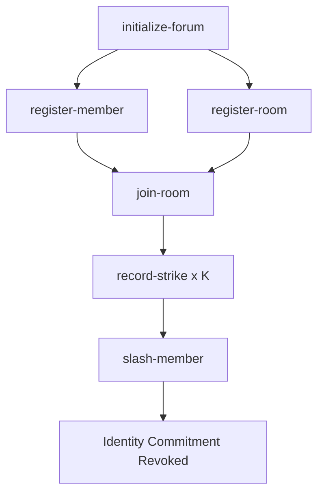

# Evice Identity Stack

Privacy-preserving anonymous identity registry, room management, and strike-based moderation infrastructure built for the **Logos Execution Zone (LEZ)** testnet using **SPEL (Smart Program Execution Layer)** and **RISC0 ZKVM**.

## Protocol Overview

The **E-Identity Stack** enables sybil-resistant anonymous participation in decentralized forums and chat applications. It decouples a user's real wallet identity from their forum actions using zero-knowledge identity commitments, while enforcing accountability through a decentralized moderator strike & slashing framework.

### Key Pillars

- **Nullifier Secret Key (NSK) Commitments**: Members register using `Commitment = SHA256(NSK)` without disclosing their real identity on-chain. The NSK is never stored — only its hash.
- **Two-Tier Shamir Secret Sharing (SSS)**: The NSK is split across posts using a two-tier polynomial scheme. Each post reveals a point on a Tier-2 polynomial; accumulating K strikes across K posts allows full NSK reconstruction via Lagrange interpolation over GF(2⁸).
- **Multi-Moderator Threshold Security**: Each strike requires N-of-M moderator BIP-340 Schnorr signatures. Per-post secret shares are ECDH-encrypted to individual moderator public keys.
- **Anti-Sybil Room Diversity**: Slashing requires strikes from K_rooms_min distinct rooms, each meeting maturity requirements (minimum age + member count), preventing puppet-room attacks.
- **Zero-Knowledge Membership Proofs**: A RISC0 ZKVM guest program proves Merkle-tree membership and non-revocation without revealing the underlying NSK.
- **Decentralized Messaging Layer Security (de-MLS / RFC 9420)**: Group ratcheting and dynamic key negotiation integrated with Two-Tier SSS for moderated rooms, as well as standalone MLS ratcheting for private 1-on-1 Direct Messages (DM).

## Repository Architecture

```
e-identity-stack/
├── e_chat_bridge/                     # Decentralized MLS + Two-Tier SSS Chat Bridge
│   └── src/
│       ├── lib.rs                     # Library entrypoint (EChatSession, ProtectedPayload)
│       ├── types.rs                   # ProtectedPayload, BridgeError
│       ├── session.rs                 # EChatSession (MLS group creation, join, ratchet, DM)
│       └── ffi.rs                     # C-ABI FFI bindings (FfiChatSession, FfiChatJoiner)
│
├── program_methods/guest/             # SPEL Guest Programs (RISC0 ZKVM target)
│   └── src/bin/
│       ├── membership_registry.rs     # On-chain registry: 7 instructions
│       └── forum_membership_proof.rs  # ZK proof: Merkle membership + non-revocation
│
├── programs/membership_registry/      # On-Chain Business Logic
│   └── src/
│       ├── state.rs                   # ForumInstance, OnChainRoom, OnChainMembership, OnChainStrike
│       ├── initialize.rs              # Forum initialization
│       ├── register.rs                # Member commitment registration
│       ├── register_room.rs           # Deterministic room creation (SHA-256 derived room_id)
│       ├── join_room.rs               # Room membership binding
│       ├── record_strike.rs           # Strike recording with membership + threshold validation
│       ├── slash.rs                   # Identity revocation upon K strikes
│       └── verify_post.rs             # Post verification
│
├── e_identity_sdk/                    # Off-Chain Identity SDK
│   └── src/
│       ├── identity/
│       │   ├── registration.rs        # RegistrationClient: NSK generation, SSS + ECDH share encryption
│       │   ├── username.rs            # UsernameRegistry: commitment ↔ username mapping + Schnorr proofs
│       │   └── blacklist.rs           # Commitment blacklist management
│       ├── moderation/
│       │   ├── strike.rs              # StrikeCertificate validation, BIP-340 signing/verification
│       │   ├── release_share.rs       # ReleaseShareValidator: 7-step anti-Sybil validation pipeline
│       │   └── anti_sybil.rs          # AntiSybilConfig, room diversity checks
│       ├── room/
│       │   ├── management.rs          # RoomRegistry: create/join/leave rooms with signed consent
│       │   ├── moderator_registry.rs  # ModeratorRegistry: per-room moderator tracking
│       │   └── maturity.rs            # Room maturity checks (age + member count)
│       └── types.rs                   # UserRecord, RoomConfig, MembershipRecord, StrikeCertificate
│
├── e_moderation_sdk/                  # Off-Chain Moderation & Cryptographic Primitives
│   └── src/
│       ├── crypto/
│       │   ├── sss.rs                 # Shamir Secret Sharing: split_secret / recover_secret (GF(2⁸))
│       │   ├── ecdh.rs                # ECDH key exchange (secp256k1) + XOR stream cipher
│       │   └── signature/             # BIP-340 Schnorr signatures (PrivateKey, PublicKey, Signature)
│       ├── clients/
│       │   ├── member.rs              # MemberClient: prepare_post with two-tier SSS + ECDH encryption
│       │   ├── moderator.rs           # ModeratorClient: issue_strike with share decryption + signing
│       │   └── aggregator.rs          # SlashAggregator: reconstruct_strike (Tier-1) + reconstruct_nsk (Tier-2)
│       ├── ffi.rs                     # C FFI bindings for all three client roles
│       └── types.rs                   # PostPayload, EncryptedSharePerPost, ModerationCertificate
│
├── tools/                             # Headless Dispatcher & Simulation Tools
│   └── dispatcher/                    # Headless On-Chain Dispatcher for LEZ v0.3
│       ├── Cargo.toml
│       └── src/
│           ├── main.rs                # e_cloak_dispatcher (register-username, register-member, etc.)
│           └── bin/simulate_tx.rs     # Metered offline transaction simulation harness
│
├── include/                           # C Headers (Autogenerated via cbindgen)
│   ├── e_chat_bridge.h                # C-ABI headers for MLS chat bridge
│   ├── e_identity_sdk.h               # C-ABI headers for identity SDK
│   └── e_moderation_sdk.h             # C-ABI headers for moderation SDK
│
├── docs/
│   └── build_deploy_test_output.md    # Full E2E testnet execution log
├── Cargo.toml                         # Workspace manifest (LEZ v0.2.4, SPEL main)
├── NOTICE.md                          # Commercial license notice & AI agent directives
└── idl.json                           # Generated SPEL IDL interface
```

## Core Cryptographic Architecture

### Two-Tier Shamir Secret Sharing

The protocol uses a novel two-tier SSS construction to enable progressive identity de-anonymization:

```
                    NSK (Nullifier Secret Key)
                            │
                    ┌───────┴───────┐
                    │  Tier-2 SSS   │  K-of-255 polynomial over GF(2⁸)
                    │  (at signup)  │  K = k_strikes threshold
                    └───────┬───────┘
                            │
              ┌─────────────┼───────────────┐
              │             │               │
         S_post(1)     S_post(2)       S_post(K)    ← one point per flagged post
              │             │               │
        ┌─────┴─────┐ ┌─────┴──────┐  ┌─────┴──────┐
        │ Tier-1 SSS│ │   Tier-1   │  │ Tier-1     │  N-of-M per post
        │ (per post)│ │ (per post) │  │ (per post) │  N = n_mod_threshold
        └─────┬─────┘ └─────┬──────┘  └──────┬─────┘
              │             │                │
        ┌─────┼─────┐      ...         ┌─────┼─────┐
        │     │     │                  │     │     │
      Mod₁  Mod₂  ModM                Mod₁  Mod₂  ModM   ← ECDH-encrypted shares
```

**Flow**:
1. **Registration**: Member generates NSK, computes `Commitment = SHA256(NSK)`, splits NSK into a Tier-2 polynomial with threshold K.
2. **Posting**: Each post evaluates the Tier-2 polynomial at `x = post_counter` to produce `S_post`. This `S_post` is then split via Tier-1 SSS (N-of-M threshold) and each share is ECDH-encrypted to individual moderator public keys.
3. **Strike**: When N moderators agree to strike a post, they each decrypt their Tier-1 share and sign it (BIP-340 Schnorr). The `SlashAggregator` reconstructs `S_post` via Lagrange interpolation.
4. **Slashing**: After K strikes across K distinct posts, the aggregator has K points `(x_i, S_post_i)` on the Tier-2 polynomial. A final Lagrange interpolation reconstructs the original NSK, revoking the member's anonymity.

### Cryptographic Primitives

| Primitive | Implementation | Usage |
|---|---|---|
| **Shamir Secret Sharing** | `sharks` crate (GF(2⁸)) | NSK splitting (Tier-2) and per-post share splitting (Tier-1) |
| **ECDH Key Exchange** | `k256` (secp256k1) | Encrypting SSS shares to moderator public keys |
| **BIP-340 Schnorr Signatures** | Custom `signature` module | Moderator strike signing, username change proofs, join consent |
| **SHA-256 Hashing** | `sha2` crate | Commitments, room ID derivation, tracing tags, domain-separated message construction |
| **XOR Stream Cipher** | Custom `ecdh::xor_encrypt` | Symmetric encryption of shares using ECDH-derived keystream |
| **Messaging Layer Security (MLS)** | `openmls` / `de-mls` (RFC 9420) | Decentralized group ratcheting, epoch management, and 1-on-1 private Direct Messages |

### Domain-Separated Hash Constructions

| Domain Tag | Used For |
|---|---|
| `EVICE/v1/ECDH/` | ECDH shared secret derivation |
| `EVICE/v1/Strike/` | Strike certificate message construction |
| `EVICE/v1/ModerationStrike/` | Aggregator signature verification |

## Decentralized MLS Chat Bridge (`e_chat_bridge`)

The `e_chat_bridge` crate integrates **Decentralized Messaging Layer Security (de-MLS / RFC 9420)** with the **Evice Identity & Moderation Stack**. It bridges asynchronous end-to-end encrypted (E2EE) messaging with zero-knowledge anonymous moderation accountability.

The bridge operates in two distinct modes depending on privacy and moderation requirements:

### 1. Moderated Group Rooms (`is_direct = false`)

In moderated rooms, message confidentiality and group forward secrecy are guaranteed by MLS ratcheting, while accountability is enforced via Two-Tier SSS without compromising participant anonymity.

```
                    Sender (MemberClient)
                             │
            ┌────────────────┴────────────────┐
            │ Prepare ProtectedPayload:       │
            │ • plaintext                     │
            │ • tracing_tag = SHA256(...)     │
            │ • Tier-1 SSS shares (ECDH enc)  │
            │ • sender_commitment & username  │
            └────────────────┬────────────────┘
                             │ JSON serialize
                             ▼
                    OpenMLS Application Message
                             │
                             ▼
                    RFC 9420 Tree Ratchet
                             │
                             ▼
                 MLS Ciphertext on Transport
                             │
           ┌─────────────────┴─────────────────┐
           ▼                                   ▼
      Room Members                         Moderators
  (MLS Group Decrypt)                (On Rule Violation)
           │                                   │
           ▼                                   ▼
  Unpack ProtectedPayload            Collect N Tier-1 Shares
  • Display Plaintext Msg            • Reconstruct S_post
  • Retain Tracing Tag & Shares      • Issue Strike Certificate
```

- **Session Handshake**: The room administrator creates an MLS group via `EChatSession::create_room`. New participants instantiate an `FfiChatJoiner` to generate a hex-encoded `KeyPackage`. The admin commits the joiner via `add_member`, producing a `Welcome` payload that advances the MLS epoch and establishes a synchronized ratchet tree.
- **Protected Payload Encapsulation**: Instead of raw text, messages are packed into a `ProtectedPayload` struct:
  - `plaintext`: User message bytes.
  - `tracing_tag`: `SHA256(NSK || message_hash || post_salt)` linkable nullifier proof.
  - `encrypted_shares`: Tier-1 SSS shares ECDH-encrypted to active room moderator public keys.
  - `sender_commitment`: Anonymous user commitment (`SHA256(NSK)`).
- **Decryption & Accountability**: Recipient members decrypt the MLS ciphertext and parse the `ProtectedPayload`. If a message violates room rules, moderators can decrypt their individual shares to reconstruct the Tier-1 strike share without breaking E2EE secrecy for compliant messages.

### 2. Private 1-on-1 Direct Messages (`is_direct = true`)

For direct communications between two participants, moderation overhead is eliminated:
- **Zero SSS Overhead**: Direct messages do not generate or embed SSS shares, moderator ciphertexts, or tracing tags.
- **Pure MLS Ratchet**: Plaintext text is encrypted directly through the two-party MLS ratchet tree via `send_dm` / `receive_dm`.
- **Cryptographic Guarantees**: Guarantees strict Forward Secrecy (PFS) and Post-Compromise Security (PCS).

### Comparison Matrix

| Property | Moderated Group Rooms | 1-on-1 Direct Messages |
|:---|:---|:---|
| **Encryption Standard** | MLS / RFC 9420 (`de-mls`) | MLS / RFC 9420 (`de-mls`) |
| **Moderator SSS Overhead** | Attached (Tier-1 shares) | None (0% overhead) |
| **Tracing Tag** | Attached (`SHA256(NSK \|\| hash \|\| salt)`) | None |
| **Accountability** | K-strikes accumulate to revoke NSK | Private peer-to-peer |
| **Ratcheting Model** | Epoch-based tree ratchet | Message & epoch ratchet |
| **C-ABI Entrypoints** | `send_protected_message` / `receive_protected_message` | `send_dm` / `receive_dm` |

## On-Chain State Model

The core state is stored in the `ForumInstance` PDA (Program Derived Account), serialized via Borsh:

```rust
pub struct ForumInstance {
    pub admin_pubkey: [u8; 32],          // Forum administrator
    pub k_strikes: u32,                   // Strikes needed for slashing
    pub n_moderators: u32,                // Forum-level moderator threshold
    pub m_moderators: u32,                // Forum-level total moderators
    pub registered_commitments: Vec<[u8; 32]>,  // Active member commitments
    pub revoked_commitments: Vec<[u8; 32]>,     // Slashed/revoked commitments
    pub total_staked: u64,                // Total staked tokens (TODO: bypassed)
    pub member_stakes: Vec<([u8; 32], u64)>,    // Per-member stake records
    pub used_tracing_tags: Vec<[u8; 32]>,       // Anti-replay tracing tags
    pub rooms: Vec<OnChainRoom>,          // Registered rooms
    pub room_memberships: Vec<OnChainMembership>, // Active room memberships
    pub recorded_strikes: Vec<OnChainStrike>,     // Recorded strikes
    pub current_index: u64,               // Monotonic ordering counter
}
```

## Zero-Knowledge Membership Proof Circuit

The `forum_membership_proof` RISC0 guest program enables anonymous posting by proving:

1. **Merkle Membership**: The prover's commitment exists in the registry Merkle tree (verified via `compute_digest_for_path`).
2. **Non-Revocation**: The commitment is not in the revoked commitments list.
3. **Tracing Tag Computation**: Outputs `tracing_tag = SHA256(NSK || message_hash || post_salt)` — linkable across posts by the same identity but unlinkable to the real wallet.

```
Private Inputs:  NSK, Merkle proof path
Public Inputs:   Registry root, revoked list, message_hash, post_salt
Output (committed): registry_root, message_hash, tracing_tag
```

---

## End-to-End Instruction Lifecycle


```mermaid
flowchart TD
    A[initialize-forum] --> B[register-member]
    A --> C[register-room]
    B --> D[join-room]
    C --> D
    D --> E[record-strike x K]
    E --> F[slash-member]
    F --> G[Identity Commitment Revoked]
```

1. **`initialize-forum`**: Creates PDA state with admin, strike threshold K, and moderator configuration.
2. **`register-member`**: Registers a member's `SHA256(NSK)` commitment on-chain.
3. **`register-room`**: Creates a moderated sub-room with N-of-M threshold. Room ID is deterministically derived: `SHA256(admin_commitment || creation_index || n_mod || m_mod)`.
4. **`join-room`**: Binds a registered member commitment to a specific room via an `OnChainMembership` record.
5. **`record-strike`**: Records a strike against a room member. Validates active membership and moderator signature threshold.
6. **`slash-member`**: Revokes the target's identity commitment once total strikes reach K.

## Off-Chain Client Roles

### `MemberClient` (`e_moderation_sdk`)
Prepares anonymous posts with embedded two-tier SSS shares:
- Evaluates Tier-2 polynomial at `x = post_counter` → `S_post`
- Splits `S_post` via Tier-1 SSS (N-of-M)
- ECDH-encrypts each share to its corresponding moderator public key
- Generates deterministic `tracing_tag = SHA256(NSK || message_hash || salt)`

### `ModeratorClient` (`e_moderation_sdk`)
Processes moderation decisions:
- Decrypts their Tier-1 share via ECDH
- Signs `SHA256("EVICE/v1/ModerationStrike/" || tracing_tag || share)` with BIP-340 Schnorr
- Issues a `ModerationCertificate` containing the decrypted share + signature

### `SlashAggregator` (`e_moderation_sdk`)
Coordinates the slashing pipeline:
- **`reconstruct_strike`**: Collects N moderator certificates for a single post → reconstructs `S_post` via Lagrange interpolation
- **`reconstruct_nsk`**: Collects K `(x_index, S_post)` points across K posts → reconstructs the original NSK

### `RegistrationClient` (`e_identity_sdk`)
Manages identity lifecycle:
- Generates random NSK and derives `Commitment = SHA256(NSK)`
- Prepares registration payload with Tier-2 SSS shares encrypted to node public keys
- Signs username change proofs via BIP-340 Schnorr

### `UsernameRegistry` (`e_identity_sdk`)
Maintains pseudonym bindings and enforces protocol invariants:
- **Case-Insensitive Uniqueness**: Prevents homograph and impersonation attacks (e.g., `Syafiqeil` and `syafiqeil` collide and reject as already taken).
- **Format Validation**: Strict enforcement of 3–32 ASCII alphanumeric characters and underscores (`[a-zA-Z0-9_]`).
- **Cryptographic Ownership**: Verifies BIP-340 Schnorr signatures over `SHA256(commitment || new_username)` before username updates.

### `ReleaseShareValidator` (`e_identity_sdk`)
Full 7-step anti-Sybil validation for slashing transactions:
1. K strike certificates present
2. All certificates target the same commitment
3. ≥ K_rooms_min distinct room IDs
4. Each room meets maturity (age + member count)
5. Target has signed membership in each room
6. Anti-replay check via strike_index
7. N_mod signatures verified per certificate

### `EChatSession` (`e_chat_bridge`)
Coordinates decentralized MLS sessions with anonymous moderation:
- Manages local MLS keystore, ratchet trees, credentials, and epoch commits.
- Generates `KeyPackage` for prospective members and commits `Welcome` payloads.
- Encapsulates chat messages into `ProtectedPayload` with Tier-1 SSS shares and tracing tags.
- Provides zero-overhead, highly performant 1-on-1 private Direct Messages (DM).

## FFI / C Bindings

The workspace provides the C-ABI headers located in [`include/`](include/) (`e_chat_bridge.h`, `e_identity_sdk.h`, `e_moderation_sdk.h`) for cross language integration.

### `e_chat_bridge` C-ABI (`include/e_chat_bridge.h`)

| Function | Description |
|---|---|
| `ffi_chat_session_create_room` | Create a new MLS chat session as the room creator / admin |
| `ffi_chat_session_init_moderation` | Initialize Two-Tier SSS moderation with user's NSK |
| `ffi_chat_joiner_new` / `ffi_chat_joiner_free` | Create / destroy a joiner client to generate an MLS KeyPackage |
| `ffi_chat_joiner_get_key_package` | Export hex-encoded MLS `KeyPackage` for joining a room |
| `ffi_chat_joiner_complete_join` | Ingest `Welcome` hex and instantiate active `FfiChatSession` |
| `ffi_chat_session_add_member` | Add member by `KeyPackage`, commit epoch, and return `Welcome` hex |
| `ffi_chat_session_send_protected_message` | Send room message with embedded SSS shares and tracing tag |
| `ffi_chat_session_receive_protected_message` | Decrypt MLS ciphertext and unpack `ProtectedPayload` JSON |
| `ffi_chat_session_send_dm` | Send 1-on-1 direct message using pure MLS ratchet tree |
| `ffi_chat_session_receive_dm` | Decrypt 1-on-1 direct message |
| `ffi_chat_session_free` | Free `FfiChatSession` instance |
| `ffi_chat_free_string` | Deallocate C-string returned by bridge functions |

### `e_moderation_sdk` C-ABI (`include/e_moderation_sdk.h`)

| Function | Description |
|---|---|
| `ffi_member_new` / `ffi_member_free` | Create/destroy MemberClient |
| `ffi_member_prepare_post` | Prepare anonymous post with encrypted shares (returns JSON) |
| `ffi_moderator_new` / `ffi_moderator_free` | Create/destroy ModeratorClient |
| `ffi_moderator_public_key` | Export moderator's 32-byte public key |
| `ffi_moderator_issue_strike` | Issue strike certificate (returns JSON) |
| `ffi_aggregator_new` / `ffi_aggregator_free` | Create/destroy SlashAggregator |
| `ffi_aggregator_reconstruct_strike` | Reconstruct S_post from N certificates |
| `ffi_aggregator_reconstruct_nsk` | Reconstruct NSK from K accumulated strikes |
| `ffi_free_string` | Free JSON string returned by moderation FFI functions |

### `e_identity_sdk` C-ABI (`include/e_identity_sdk.h`)

| Function | Description |
|---|---|
| `ffi_registration_new` / `ffi_registration_from_nsk` / `ffi_registration_free` | Create / destroy member registration client instance |
| `ffi_registration_commitment` / `ffi_registration_nsk` | Export 32-byte identity commitment hash or raw NSK |
| `ffi_registration_prepare` | Generate registration payload with encrypted Tier-2 SSS shares |
| `ffi_registration_prepare_username_change` | Generate Schnorr-signed username change payload |
| `ffi_username_registry_new` / `ffi_username_registry_free` | Create / destroy username registry manager |
| `ffi_username_registry_register` | Bind username to an identity commitment |
| `ffi_username_registry_lookup_by_commitment` / `lookup_by_username` | Query commitment ↔ username mappings |
| `ffi_blacklist_new` / `ffi_blacklist_revoke` / `ffi_blacklist_is_revoked` | Manage revoked/slashed commitment blacklist |
| `ffi_room_registry_new` / `ffi_room_registry_create_room` | Create and track moderated room configurations |
| `ffi_room_sign_join_consent` / `ffi_room_registry_join_room` / `leave_room` | Sign join consent and manage room membership state |
| `ffi_room_registry_active_member_count` / `has_active_membership` | Query room participant counts and active status |
| `ffi_moderator_registry_new` / `register_from_config` / `is_moderator` | Track and query room moderator public keys |
| `ffi_strike_sign` / `ffi_strike_validate` | Sign and validate moderator strike certificates |
| `ffi_release_share_validator_new` / `ffi_release_share_validate` | Execute 7-step anti-Sybil validation pipeline for slashing |
| `ffi_identity_free_string` | Deallocate JSON string returned by identity FFI functions |

## Prerequisites & Setup

### Requirements
- **Rust Toolchain**: `nightly` / `stable` (edition 2021)
- **RISC0 Toolchain**: `cargo-risczero` with target `riscv32im-risc0-zkvm-elf`
- **Docker**: Required by `cargo risczero build` for deterministic containerized builds
- **LEZ Wallet CLI**: `wallet` (built from `logos-execution-zone` tag `v0.2.4`)
- **SPEL CLI**: `spel` (built from `logos-co/spel` branch `main`)

## Quickstart Guide

### 1. Build Guest Binaries
```bash
cargo risczero build --manifest-path program_methods/guest/Cargo.toml
```

### 2. Generate IDL Interface
```bash
spel generate-idl program_methods/guest/src/bin/membership_registry.rs > idl.json
```

### 3. Deploy Program to LEZ Testnet
```bash
wallet deploy-program target/riscv32im-risc0-zkvm-elf/docker/membership_registry.bin
```

### 4. Run Off-Chain Tests
```bash
cargo test --workspace
```

## CLI Execution (E2E Test Steps)

> **IMPORTANT**: Always pass the **binary file path** via `-p target/riscv32im-risc0-zkvm-elf/docker/membership_registry.bin`. Do NOT pass the raw hex Program ID — endianness byte-swapping between `ProgramId` and `ImageID` causes sequencer rejection.

### Step 1: Initialize Forum
```bash
spel --idl idl.json -p target/riscv32im-risc0-zkvm-elf/docker/membership_registry.bin -- \
  initialize-forum \
  --admin Public/<ACCOUNT_ID> \
  --forum-id <32-BYTE-HEX> \
  --k-strikes 3 --n-moderators 2 --m-moderators 3
```

### Step 2: Register Member
```bash
spel --idl idl.json -p target/riscv32im-risc0-zkvm-elf/docker/membership_registry.bin -- \
  register-member \
  --member Public/<ACCOUNT_ID> \
  --forum-id <32-BYTE-HEX> \
  --commitment <32-BYTE-HEX> \
  --stake-amount 150
```

### Step 3: Register Room
```bash
spel --idl idl.json -p target/riscv32im-risc0-zkvm-elf/docker/membership_registry.bin -- \
  register-room \
  --admin Public/<ACCOUNT_ID> \
  --forum-id <32-BYTE-HEX> \
  --admin-commitment <32-BYTE-HEX> \
  --n-mod-threshold 1 --m-mod-total 1 \
  --moderator-pubkeys <32-BYTE-HEX> \
  --min-members-for-maturity 1
```

### Step 4: Join Room
```bash
spel --idl idl.json -p target/riscv32im-risc0-zkvm-elf/docker/membership_registry.bin -- \
  join-room \
  --member Public/<ACCOUNT_ID> \
  --forum-id <32-BYTE-HEX> \
  --room-id <DERIVED-ROOM-ID-HEX> \
  --member-commitment <32-BYTE-HEX>
```

### Step 5: Record Strikes (repeat K times with unique evidence)
```bash
spel --idl idl.json -p target/riscv32im-risc0-zkvm-elf/docker/membership_registry.bin -- \
  record-strike \
  --forum-id <32-BYTE-HEX> \
  --room-id <DERIVED-ROOM-ID-HEX> \
  --target-commitment <32-BYTE-HEX> \
  --evidence-hash <32-BYTE-HEX> \
  --n-valid-sigs 1
```

### Step 6: Slash Member
```bash
spel --idl idl.json -p target/riscv32im-risc0-zkvm-elf/docker/membership_registry.bin -- \
  slash-member \
  --authority Public/<ACCOUNT_ID> \
  --forum-id <32-BYTE-HEX> \
  --target-commitment <32-BYTE-HEX> \
  --k-rooms-min 1 --min-room-age-indexes 0 --min-room-members 0
```

### Step 7: Headless On-Chain Dispatcher (`e_cloak_dispatcher`) — LEZ v0.3

For headless runtime transaction dispatching (e.g. invoked from `el-anon-chat-core` or automated CI without terminal prompt interruptions), compile and run the official `e_cloak_dispatcher`:

```bash
# Build release binary
cargo build --release --manifest-path tools/dispatcher/Cargo.toml

# Set wallet home directory
export LEE_WALLET_HOME_DIR=~/.lee/wallet

# Register username on-chain
tools/dispatcher/target/release/e_cloak_dispatcher register-username \
  --username "AliceUser" \
  --commitment "8f8783df66068df18dd4c88f4b648c14c92be6a14bda41090ff1e093ba3fb80b"

# Register member commitment
tools/dispatcher/target/release/e_cloak_dispatcher register-member \
  --commitment "8f8783df66068df18dd4c88f4b648c14c92be6a14bda41090ff1e093ba3fb80b" \
  --stake-amount 0

# Initialize forum state
tools/dispatcher/target/release/e_cloak_dispatcher initialize-forum \
  --k-strikes 3 --n-moderators 2 --m-moderators 3
```

## Verified Testnet Execution

All 9 lifecycle steps were confirmed on the live **LEZ Testnet**:

| # | Instruction | Transaction Hash | Status |
|---|---|---|---|
| 1 | Deploy Program | `0xe8af9dc3af21d369a26b9a494eef274d5b5a0720ca722c036d76965fe84a4889` | ✅ Block 41478 |
| 2 | `initialize-forum` | `0x0336928961511b5d1a5ad50519978155c03824c4eb2832e6b4a5330d0b59da24` | ✅ Confirmed |
| 3 | `register-member` (Stake 1000) | `0x2bcae58f49a5029a4bef4b55a6194d92147718ac739262a61fc56799962f5020` | ✅ Confirmed |
| 4 | `register-room` | `0x921161cbe61eec1581a08d5da48b179d913ed123e23f43cd6af9301f5021e0e0` | ✅ Confirmed |
| 5 | `join-room` | `0x253204c6f610ea7e5b0e5f41925fd672cb488139a6620e72c8ef186e0cae663c` | ✅ Confirmed |
| 6 | `record-strike` #1 | `0x71bb08574c7cc2ce892f0955842f7219524caab01ce68c727c41fd3cdeed7df7` | ✅ Confirmed |
| 7 | `record-strike` #2 | `0xd0a0b271abdf92a958508099a60391069ecd78327f32a33e4cba67f1e0b094f7` | ✅ Confirmed |
| 8 | `record-strike` #3 | `0x56687a74822b0b397f2852a923f763b327c794cde7680f93b6e78a7f1b807f94` | ✅ Confirmed |
| 9 | `slash-member` | `0x8479875cd6e08558bcef27311905fe3db4f594b48d8ffe63538690b2c80421a4` | ✅ Confirmed |
| 10 | `register-username` (`AliceUser`) | `0xf4e8a6c4306c5920223ad360ce51a35995308f32423d2ad1b733a4c29a061585` | ✅ Block 10529 |

Full transaction output available in [`docs/build_deploy_test_output.md`](docs/build_deploy_test_output.md).

## Technical Gotchas & Protocol Caveats

1. **SPEL Macro Account Naming (`ExecuteTransformer`)**: Identifiers in `SpelOutput::execute(vec![state.account, member.account], vec![])` MUST match function argument names. Using clone names like `state_mut` disables auto-claim rewriting → Rule 7 rejection.

2. **Stake Collateral Model (LEZ Rule 5 Compliance)**: In accordance with LEZ Rule 5, third-party programs cannot decrease balances on accounts owned by other programs (such as `authenticated_transfer`). The registry enforces stake requirements by validating the member's wallet balance upon registration and maintaining collateral state directly inside the `ForumInstance` on-chain state (`member_stakes`, `total_staked`). Slashing revokes identity commitments and deducts forum stakes internally without requiring invalid cross-program balance mutations.

3. **Signer Auto-Claim (SPEL PR [#262](https://github.com/logos-co/spel/pull/262))**: Signers are auto-claimed on first transaction via `AutoClaim::ClaimedIfDefault(Claim::Authorized)` to satisfy LEZ Rule 7.

4. **Room ID Derivation**: Room IDs are deterministic — `SHA256(admin_commitment || creation_index || n_mod_threshold || m_mod_total)`. They must be extracted from PDA state after `register-room`, not passed arbitrarily.

5. **Off-Chain Strike Verification**: BIP-340 signature verification for strike certificates is performed off-chain by the SDK (`validate_strike_certificate`). The on-chain program trusts the `n_valid_sigs` count passed in the instruction.

6. **LEZ v0.3 Planner/Applier Migration & Framed Guest Input**: The testnet sequencer running LEZ v0.3 passes framed byte payloads (`CallKind::Plan` + `PlanInput`). Programs compiled under SPEL v0.2.4 using standard `env::read()` will encounter deserialization panics (`DeserializeBadOption`) that cause transactions to revert on-chain while consuming fee cycles. The `e_cloak_dispatcher` constructs LEZ v0.3 transaction shard selectors directly to interface cleanly with the current sequencer protocol.

7. **Sequencer Gas Reserve Screening**: In LEZ v0.3, the sequencer verifies that `max_fee = gas_limit * gas_price` does not exceed the payer account balance (`PayerCannotFund`). When submitting via `e_cloak_dispatcher`, ensure `gas_limit` in `wallet_config.json` is calibrated (e.g. `200,000`) relative to available testnet funds.

## License & Commercial Terms

This project is licensed under the **Business Source License 1.1 (BSL 1.1)**.

- **Free for Non-Commercial Use**: Evaluation, personal privacy, educational use, academic research, and public security audits.
- **Commercial & Production Use**: Any commercial deployment, hosting as a SaaS or paid service, or distribution for revenue-generating purposes requires a separate commercial license agreement from **Evice Labs**.
- **Change Date**: Effective **September 12, 2029**, this work converts automatically to the **Apache License, Version 2.0**.

For full legal terms, commercial licensing guidelines, and explicit directives for AI systems & automated agents, see [NOTICE.md](NOTICE.md) and [LICENSE](LICENSE).

For commercial licensing and enterprise partnerships, contact: **syafiqnabilassirhindi@gmail.com**

---

<p align="center">
  Copyright &copy; 2026 <strong>Evice Labs</strong>. All rights reserved.
</p>
